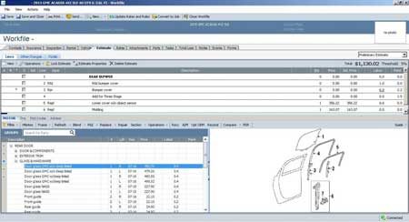

## CCC ONE ESTIMATING SOFTWARE FIX
### Resolves issue of vehicle diagram images from not displaying in CCC One Estimating Software



```javascript

Batch file that deletes the temporary files from within the temporary file folder for CCC One Estimating.

This resolve the vehicle diagram images from not displaying in CCC One Estimating Software and 
does not mess up the "3rd party applications" that use the same temporary folder for working file storage.

To run batch file simply download file to the computer that has CCC One Estimating Software installed on
it with vehicle diagrams not displaying in program. Close CCC One Estimating Software and double click on
"delccctemp.bat" file, the CCC One Estimating Software temporary files will be deleted. Restart CCC One Estimating
and you are ready to go.

```

```javascript

File last updated: 03-26-2016

```
